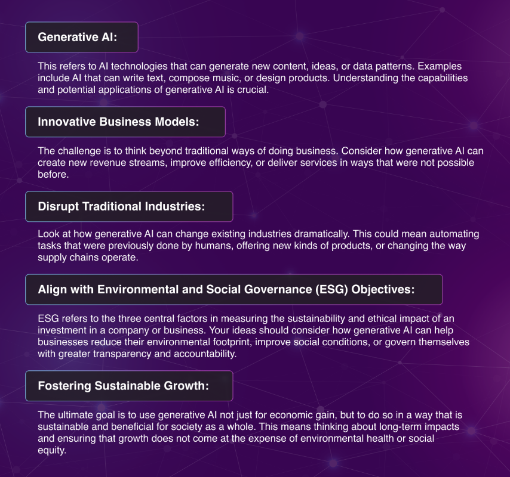

## Theme
The theme "Leverage Generative AI to create innovative business models that disrupt traditional industries or align with environmental and social governance objectives, fostering sustainable growth for businesses and society alike." and encourages students to think creatively about how artificial intelligence can be used to transform existing industries or help businesses meet sustainability goals.

